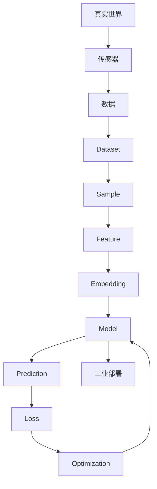

# Knowledge Map

本文件维护整本书的知识关系。章节写作和重构必须优先遵守这里的关系。

## 核心链路

## 章节知识候选

| 章节 | 核心概念 | 工业 3D 视觉落点 | 状态 |
| --- | --- | --- | --- |
| Chapter 01 | Dataset | 点云、图像、标注、现场采样偏差 | Planned |
| Chapter 02 | Feature | 几何特征、纹理特征、学习特征 | Planned |
| Chapter 03 | Embedding | 相似性、检索、缺陷表征 | Planned |
| Chapter 04 | Model | 从规则到可学习函数 | Planned |
| Chapter 05 | Loss | 目标、惩罚、工程代价 | Planned |
| Chapter 06 | Optimization | 训练为什么会变好 | Planned |

## 维护规则

- 新章节必须说明它连接到哪一个已有概念。
- 新术语必须同步写入 `GLOSSARY.md`。
- 新工业案例必须同步写入 `CASE_LIBRARY.md`。

