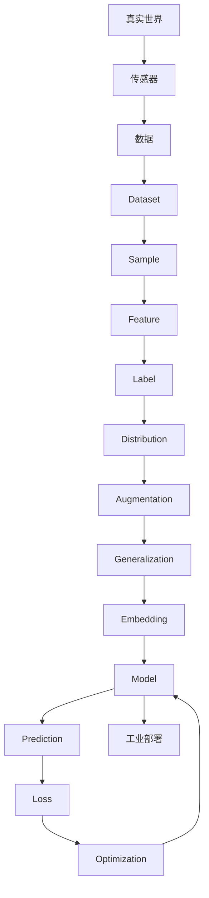

# Knowledge Map

本文件维护整本书的知识关系。章节写作和重构必须优先遵守这里的关系。

## 核心链路

## 章节知识候选

| 章节 | 核心概念 | 工业 3D 视觉落点 | 状态 |
| --- | --- | --- | --- |
| Chapter 01 | Dataset | 点云、图像、现场采样偏差、覆盖范围 | Spec Draft |
| Chapter 02 | Sample | 单帧点云、单张图像、一次多模态采样 | Planned |
| Chapter 03 | Feature | 几何特征、纹理特征、学习特征 | Planned |
| Chapter 04 | Label | 缺陷标签、位姿标签、区域标注、质量标准 | Planned |
| Chapter 05 | Distribution | 训练现场与真实现场的差异 | Planned |
| Chapter 06 | Augmentation | 光照、姿态、噪声、遮挡和点云扰动 | Planned |
| Chapter 07 | Generalization | 未见工件、未见批次、未见环境变化 | Planned |

## 维护规则

- 新章节必须说明它连接到哪一个已有概念。
- 新术语必须同步写入 `GLOSSARY.md`。
- 新工业案例必须同步写入 `CASE_LIBRARY.md`。
- 章节顺序必须与 `CURRICULUM.md` 保持一致。
